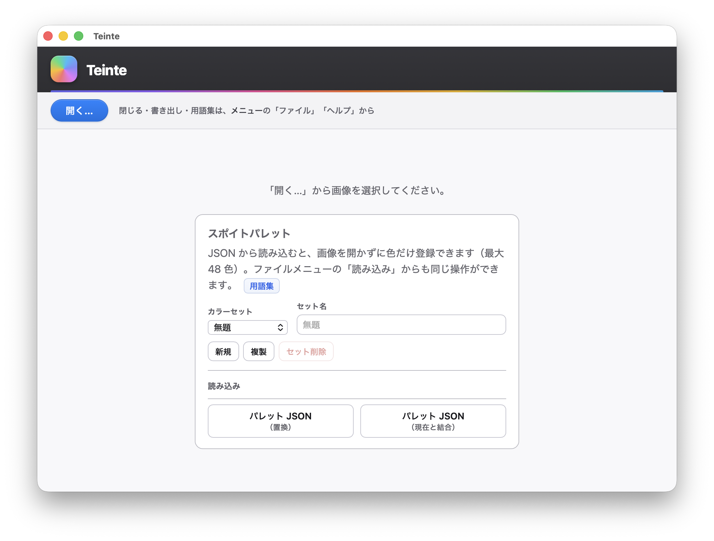

# Teinte

[English](README.en.md)

**画像の色を調べ、制作に使う色を整理し、結果を記録する制作支援デスクトップアプリ**です。画像編集アプリではありません。

イラスト制作で繰り返す「画像から色を拾う」「肌・髪・影などの用途名を付ける」「カラーセットとして残す」「制作資料として JSON / PDF に書き出す」という作業を、1つのローカルアプリで扱うために作りました。画像そのものは外部サーバーへ送らず、手元の端末で解析します。

**[最新版 v0.4.3 をダウンロード →](https://github.com/tsukasa-art/teinte/releases/tag/v0.4.3)**<br>
macOS（Apple Silicon / Intel）・Windows向けの成果物をGitHub Releasesで公開しています。

| 領域 | 技術 |
|---|---|
| UI | Vue 3、TypeScript、Vite |
| デスクトップ | Tauri 2 |
| 画像解析・配色ロジック | Rust |
| 検証 | Vitest、`cargo test`、GitHub Actions |

[アーキテクチャ](docs/architecture.md) · [解析ロジック](docs/image-analysis.md) · [変更履歴](CHANGELOG.md)



## 操作の流れ

1. **開く** — PNG / JPEG / GIF / WebP / BMP を選ぶ
2. **色を拾う** — プレビューをクリックして原画像の1ピクセルを取得する
3. **名前を付ける** — 「肌」「髪の影」「瞳」など制作上の用途を記録する
4. **セットで残す** — 最大48色のカラーセットを複数保存する
5. **保存・出力** — パレット／分析結果をJSONへ、分析レポートをPDFへ書き出す

## 主な機能

- プレビュー上のクリック位置の色（HEX / RGB / HSL）
- 支配色・Open Color / Tailwind 近似色・要約（gist）
- **WCAGと同じ式によるコントラスト比**（主要色1位・2位のみ。AA / AAA合否判定ではありません）
- **PCCS風トーン**（Lab値から付ける非公式・便宜的な近似ラベル）
- **配色の役割分類**（支配色の累積割合による便宜的なベース / アソート / アクセント分類。しきい値スライダー付き）
- **スポイトパレット**（メモ名、48 色上限、セットの切り替え・複製・削除）
- **分析／パレットの JSON**（コピー、ファイル保存、ファイルからの読み込み）
- **PDF 書き出し**（プレビュー・ファイル名・主要色・ひと目サマリ・Open/Tailwind 近似（ΔE2000）・WCAG比・色彩理論メモ・EXIFをラスタ化して出力）
- **用語集**（ヘルプメニュー）

<details>
<summary><strong>画面上の用語と算出方法を読む</strong></summary>

### 画面上の用語

README やリポジトリだけを見る人向けに、よく出る語を短くまとめます。定義の細部・注意書きは **起動後のヘルプ → 用語集** に詳しく書いています。

| 用語 | 説明 |
|------|------|
| **支配色** | 画像を**グリッド間引き**（目安 **約 15 万サンプル**相当になるようステップを決定）し、**Lab 空間の k-means**（初期重心は決定的 **farthest-first**）で似た色をまとめます。各グループの**代表色**は **Lab 重心を sRGB に逆変換**した色です。**％** は画像ピクセル全体の厳密な面積率ではなく、**間引き後に残したサンプルに占める割合の目安**です。画面上の見出しは **「主要色（推定）」** です。 |
| **近似色** | **Open Color** や **Tailwind** の「名前の付いた色」の一覧から、支配色に**いちばん近い色**を探した結果です。近さは **CIEDE2000（ΔE00）**（小さいほど近い）で示します。 |
| **WCAG 支配色ペア** | **％が大きい順**の支配色の **1 位と 2 位**だけを使ったコントラスト比です。実際の文字色・背景色を指定した検査や **AA / AAA の合否判定ではありません**。 |
| **色彩理論ブロック** | **L\*・C\*・色相**や **PCCS 風トーン**などをまとめたメモです。PCCS風トーンはLab値を便宜的な閾値へ当てはめた非公式の近似ラベルで、公式PCCS判定ではありません。 |
| **配色の役割分類** | 支配色の累積割合を可変閾値で区切る便宜的な分類です。画像内の意味やデザイン上の役割を認識しているわけではありません。 |
| **要約（gist）** | 分析結果を**短い行**にまとめたテキスト。日本語のまとめ全文をコピーする操作もあります。 |

</details>

## スポイトパレットとカラーセット

- 各セットに名前（任意）を付与できます。**新規**で空のセットを追加し、**複製**で現在のセットをコピーします（色の id は新規発行）。**セット削除**は確認ダイアログ付きです。
- **色をすべて削除**は、選択中のセット内の色のみを消去します。セット自体は残ります（確認あり）。
- 各色チップの **×** で 1 色削除（確認あり）。
- セット名が `パレット 1` のように **`パレット` + 半角スペース + 数字**のみの場合、セット削除後に配列順で `パレット 1`, `パレット 2`, … へ**連番を振り直します**。`肌パレット` など任意の名前は変更しません。

## JSON の取り扱い

| 操作 | 内容 |
|------|------|
| **パレット JSON（置換）** | 現在のセットの色一覧を、ファイルの内容で置き換えます。JSON に `name` があればセット名も更新します。 |
| **パレット JSON（結合）** | 読み込んだ色を先頭に追加し、48 色を超える分は切り捨てます。 |
| **分析 JSON** | エクスポート形式に近い JSON から分析状態を復元します（プレビュー画像の base64 は省略可）。 |

**分析結果 JSON** のルート `schemaVersion` は現在 **`4`**（アルゴリズム更新の目印）。下記 **パレット**の `schemaVersion: 1` とは**別物**です。

旧 `schemaVersion: 3 / 4` の分析JSONは、`harmonyScores` や絶対パスを含む場合も引き続き読み込めます。新しくコピー・保存する共有用JSONでは、元画像の**絶対パスを出さずファイル名だけ**を`path`へ記録し、`harmonyScores` とプレビュー画像のbase64を省略します。`schemaVersion`は`4`のままです。

パレット JSON は、`kind: "pickerPalette"` と `entries` を含む形式、または `entries` のみのオブジェクト／配列にも対応します。書き出し時、セット名が空でなければルートに `name` が付与されます。

メニューの **ファイル → 読み込み**、または画像未選択時のホーム画面から同様の操作ができます。

## データの保存場所

スポイトパレットは、**アプリ内の WebView が提供する `localStorage`**（キー `teinte.pickerPalette`）に保存されます。API は Web と同じですが、**保存先はこのアプリ用の領域**であり、Chrome など通常のブラウザのプロファイルとは別です。

開発時は **`pnpm tauri dev`** の **埋め込み WebView** と、**`pnpm dev` だけ**で開いた **ブラウザのタブ**では、たとえ同じ `localhost` のオリジンでも **ストレージが別**のため、**パレットは共有されません**（どちらで動かしているかでデータが別になります）。

保存される JSON には **`schemaVersion`** があり、**パレットデータの形（スキーマ）が変わったときだけ**番号が上がります。**アプリ本体のバージョン（0.4.0 など）とは別物**です。いまの形式は **`schemaVersion: 1`** で、ルートに次のフィールドがあります。

- `schemaVersion`（数値、現在は `1`）
- `activePaletteId`
- `palettes[]`（各要素に `id`, `name`, `entries`, `updatedAt`）

それより古い **「エントリ配列だけ」** の保存データは、起動時に 1 セットへ包んで自動移行します。

**パッケージ版**ではアプリのアンインストールやアプリデータの消去、**開発時**ではブラウザのサイトデータ削除や **Tauri 開発用ウィンドウ側のデータ消去**などで失われることがあります。重要なパレットは **JSON で書き出して保管**してください。

### 共有前に確認する情報

- 共有用JSON / PDFには絶対パスを出さず、元画像の**ファイル名だけ**を記録します。
- JSON / PDFには、画像寸法、ファイル更新日時、カメラ機種・撮影日時などの**EXIF**、主要色などの解析結果が含まれることがあります。
- PDFは画面用の内容をラスタ画像として出力します。第三者へ渡す前に、表示内容とEXIFを確認してください。

## 既知の制限

- 入力は現在のRust decoderで扱う **PNG / JPEG / GIF / WebP / BMP** に限定しています。
- 色計算は **sRGB前提**です。ICCプロファイルを考慮した厳密な色管理やCMYK変換には対応しません。
- WCAG表示は主要色1位・2位の比だけで、AA / AAA合否判定ではありません。
- PCCS風トーンはLab値による便宜的な近似ラベル、配色役割は主要色の割合による便宜的な分類です。
- 旧来の色相配置値は内部解析と旧 `schemaVersion: 3 / 4` JSONの読み込み互換性のため保持していますが、欠けた理想色相を評価できません。新しい共有JSON、ひと目サマリ、PDFには含めず、UIでは**実験的表示**へ降格しています。補色・トライアド・テトラードへの適合度としては使用できません。
- PDFは画面内容をhtml2canvasでラスタ化した出力で、文字主体のネイティブPDFではありません。
- 画像の描画・補正・変換、システム全体のスポイト、複数画像の一括解析は対象外です。

## 確認ダイアログ

macOS の WebView では **`window.confirm` が表示されない**場合があるため、破壊的操作の確認には **`@tauri-apps/plugin-dialog` の `confirm`** を使用しています。`pnpm dev` でブラウザのみ起動した場合は `window.confirm` にフォールバックします。

## バージョンとリリース

`package.json`・`src-tauri/tauri.conf.json`・`src-tauri/Cargo.toml` の **version は同一の値**に揃えています（現在 **0.4.3**）。README 本文に同じ版番号が複数ある場合は、**リリース時にまとめて更新**してください。変更履歴は **`CHANGELOG.md`** を参照してください。

**セマンティックバージョニング（目安）**: `x.y.z` で、**メジャー `x`** は互換性の大きな断ち切り、**マイナー `y`** は後方互換を保った機能追加や利用者に伝えたい変更（解析結果の意味が変わる更新など）、**パッチ `z`** はバグ修正や内部リファクタ・ドキュメント中心、という整理です。**1.0 未満（0.y.z）**の間も同じ考え方を目安にし、**分析 JSON の `schemaVersion` やパレットの `schemaVersion`** はアプリの `x.y.z` とは別ライフサイクルです（上記「データの保存場所」も参照）。

リリース用タグ（**注釈付き**＝メッセージ付き。GitHub Releases などで「このコミットがこの版」と示すしおり）の例:

```bash
git push origin main
git tag -a v0.4.3 -m "0.4.3"
git push origin v0.4.3
```

`git push` だけではタグは送られません。タグをリモートに載せるときは `git push origin v0.4.3` が必要です。リモート名は環境に合わせて読み替えてください。

## 技術スタック

| 領域 | 技術 |
|------|------|
| UI | Vue 3, TypeScript, Vite |
| デスクトップシェル | Tauri 2 |
| 画像解析・配色ロジック | Rust（`src-tauri`） |
| テスト | Vitest（フロントエンド）、`cargo test`（Rust） |

処理の流れとディレクトリ構成は [docs/architecture.md](docs/architecture.md)（Mermaid 図・簡易ツリー）、**解析ロジックの要点**は [docs/image-analysis.md](docs/image-analysis.md) にまとめています。

### フロント（`src/`）の置き場

- **`App.vue`** … ルートの組み立て（ヘッダー・ツールバー・`main` グリッド）と composable の配線。
- **`src/composables/`** … トースト・画像セッション・スポイトパレット・用語集・補助色モードなど、画面ロジックのまとまり。
- **`src/components/`** … `AnalysisSidePanel` / `EmptyWorkspace` / `PaletteHomeCard`（ホームのパレット案内）など領域単位の UI。
- **`src/styles/analysisWorkspace.css`** … 分析パネル・空ワークスペース向けの共通スタイル（`main.ts` で読み込み）。

## ドキュメントの読み方

| 文書 | 主な内容 |
|------|----------|
| **README.md**（本ファイル） | 機能概要・用語のやさしい説明・既知の制限・開発手順 |
| **[docs/architecture.md](docs/architecture.md)** | Tauri / Vue / Rust の役割、典型フロー、ディレクトリツリー |
| **[docs/image-analysis.md](docs/image-analysis.md)** | 支配色・色差（ΔE2000）・WCAG・実験値の既知の制限・gist など **Rust 側アルゴリズム**の地図 |
| **[CHANGELOG.md](CHANGELOG.md)** | バージョンごとの変更履歴（細かな挙動はここと image-analysis を優先） |

用語の詳細や注意書きは、起動後の **ヘルプ → 用語集** も参照してください。

## CI（GitHub Actions）

`main` ブランチへの **push** および **pull_request** で [`.github/workflows/ci.yml`](.github/workflows/ci.yml) が実行されます。

1. **Ubuntu**: `pnpm install` → `pnpm run test` → `pnpm run build` → `src-tauri` で `cargo test`（Linux 向けに WebKit／GTK 系のシステムパッケージをインストール）
2. **macOS（Apple Silicon）**・**Windows**（上記成功後）: `pnpm exec tauri build` によるビルド確認

## 開発

```bash
pnpm tauri dev      # 開発用（フロント + Tauri）
pnpm run test       # Vitest
pnpm run build      # vue-tsc --noEmit && vite build
cd src-tauri && cargo test
pnpm tauri build    # 配布用ビルド
```

**環境変数 `CI=1` のとき**（Cursor のターミナルなど）、Tauri 2 の CLI が `--ci` を解釈できず失敗することがあります。その場合は `CI=false pnpm exec tauri build` のように **`CI` を無効化**してから実行してください。

## 配布ビルドと GitHub Releases

`v*` タグをプッシュすると **`.github/workflows/release.yml`** が起動し、macOS（Apple Silicon / Intel それぞれ・ファイル名は `aarch64` / `x64` などで区別）・Windows の成果物を自動ビルドして GitHub Releases に**下書き**で作成します。内容を確認してから手動で公開してください。

```bash
git tag -a v0.4.3 -m "0.4.3"
git push origin v0.4.3
```

> **macOS でのインストール注意**: Apple Developer 証明書による署名・公証を行っていないため、初回起動時に「壊れているため開けません」または「開発元を確認できません」と表示されることがあります。その場合はターミナルで以下を実行してから起動してください。
>
> ```bash
> xattr -d com.apple.quarantine /Applications/Teinte.app
> ```
>
> または `.dmg` マウント後にアプリを**右クリック → 開く**で起動できる場合もあります。

ローカルでビルドする場合:

1. 上記 **`pnpm tauri build`**（必要なら `CI=false` 付き）で成果物を生成します。バイナリは **git にはコミットしません**。
2. 典型的な出力先（macOS の例。CPU アーキテクチャでファイル名が変わります）:
   - `src-tauri/target/release/bundle/dmg/` … **`.dmg`**
   - `src-tauri/target/release/bundle/macos/` … **`.app`**
3. **Linux 用**（`.deb` / `.AppImage` など）は、同じコマンドを **Linux 上**で実行するか、GitHub Actions で `ubuntu-latest` 上に `tauri build` ジョブを足して成果物を Release に添付する方法が一般的です（macOS から単体コマンドだけでは Linux バンドルは作られません）。

推奨エディタ: [VS Code](https://code.visualstudio.com/) と [Vue - Official](https://marketplace.visualstudio.com/items?itemName=Vue.volar)、[Tauri](https://marketplace.visualstudio.com/items?itemName=tauri-apps.tauri-vscode)、[rust-analyzer](https://marketplace.visualstudio.com/items?itemName=rust-lang.rust-analyzer)。
